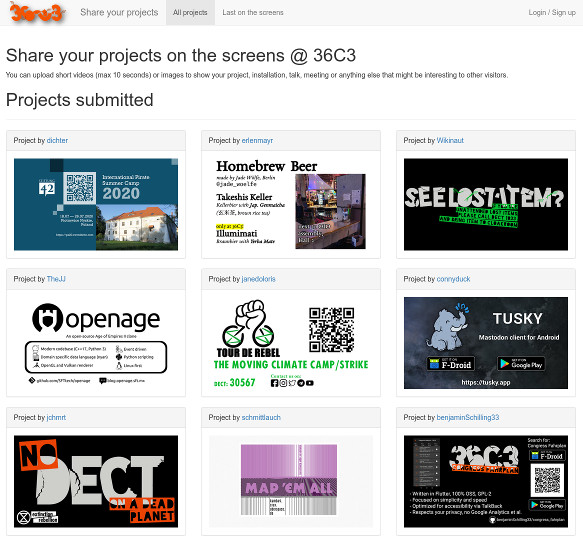

# 36C3 CMS



# About

This is a quickly hacked together content management system
running at the [36C3 event](https://events.ccc.de/congress/2019/) in
late 2019.

It allows login to users with github accounts and they can upload
images/videos. Upon moderation approval it will sync them into a
playlist in a [scheduled player](https://info-beamer.com/pkg/4765) based setup.

It uses the new [adhoc access feature](https://info-beamer.com/doc/api#createadhocaccess)
and users will directly upload their assets to info-beamer.com.

Consider this example code and this repository should be treated
as a code dump instead of a finished product. The code might help
you understand how to use the info-beamer API though.

# Installation

Should work somewhat like this on Ubuntu 18.04:

```
git clone this_repo /service/cms && cd /service/cms
apt install python-oauth2client python-flask python-jinja2
virtualenv --system-site-packages env
. env/bin/activate
easy_install -U deps/GitHub-Flask-3.2.0.tar.gz
```

As for running in "production". I've been using cloudflare
in Full(strict) certificate mode:

```
apt install nginx-full daemontools-run
cp nginx.conf /etc/nginx/
# put required certs into referenced directory
service nginx restart

# adapt those settings
cp settings.example.cfg settings.cfg
ln -s /service/cms /etc/service

# Add this to crontab
*/5 * * * * curl http://127.0.0.1:8000/sync
```
